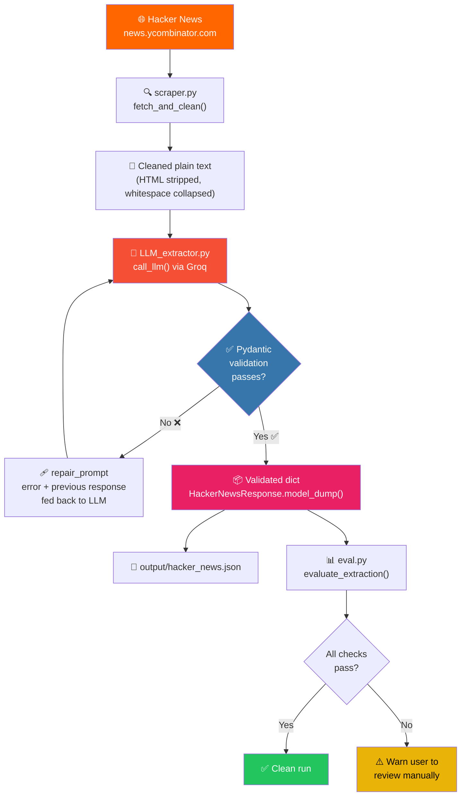
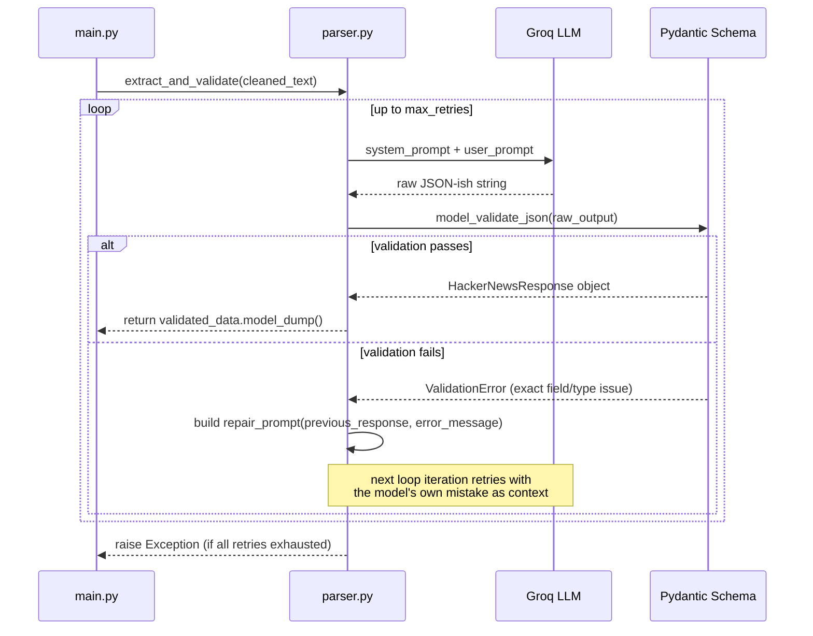
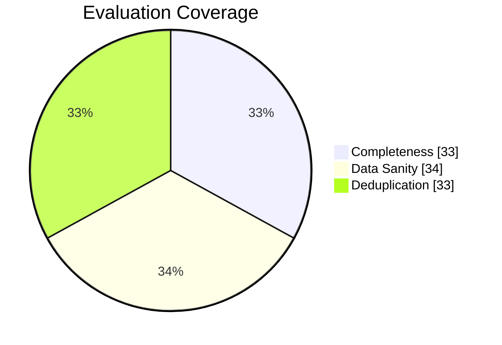

<div align="center">

# 🕸️ LLM WEB SCRAPER

### Reflexion LLM Data Extraction Pipeline

Scrape → Extract → Validate → Auto-Repair → Evaluate

Turns messy, unstructured Hacker News HTML into **guaranteed-valid, schema-checked JSON** — with an LLM that fixes its own mistakes.

[](https://www.python.org/)
[](https://docs.pydantic.dev/)
[](https://groq.com/)
[](https://www.crummy.com/software/BeautifulSoup/)
[](#-license)

</div>

---

## ✨ Why this exists

LLMs are great at reading messy text and terrible at reliably outputting *exact* JSON schemas. Ask five times, get five slightly different shapes — a renamed field here, a missing key there, a stray markdown fence wrapping the whole thing.

**HN-Extract solves that with a closed-loop retry system**: every time the model's output fails schema validation, the *exact* Pydantic error gets fed straight back into a repair prompt, and the model tries again — until it converges on something valid, or the process gives up loudly instead of silently returning garbage.

---

## 🧠 How it works



### The self-repair loop, up close



---

## 📁 Project structure

```
hn-extract/
├── main.py              # 🎯 Orchestrator — wires every stage together
├── scraper.py            # 🌐 Fetches HN homepage, strips HTML → clean text
├── prompt_template.py     # ✍️  system_prompt / user_prompt / repair_prompt
├── schema.py              # 📐 Pydantic models — the contract everything must satisfy
├── LLM_extractor.py        # 🤖 Thin wrapper around the Groq chat completion call
├── parser.py                # 🔁 The retry-and-repair validation loop
├── eval.py                   # 📊 Post-hoc quality report (completeness, sanity, dupes)
├── output/
│   └── hacker_news.json       # 📦 Final validated output, written each run
├── .env                         # 🔑 GROQ_API_KEY (never commit this)
└── requirements.txt
```

---

## 🧩 The schema contract

Everything downstream is judged against this — the single source of truth the LLM is repeatedly steered toward:

```python
class NewsArticle(BaseModel):
    title: str
    points: int
    time_ago: str

class HackerNewsResponse(BaseModel):
    status: Literal["ok"]
    articles: list[NewsArticle] = Field(min_length=5, max_length=5)
```

If the model returns `top_articles` instead of `articles`, or `time_posted` instead of `time_ago`, or wraps the JSON in ` ```json ` fences — validation fails, the exact Pydantic error is captured, and the loop tries again.

---

## 🚀 Quickstart

```bash
# 1. Clone
git clone https://github.com/PUNITH-V/llm-web-scraper.git
cd hn-extract

# 2. Set up environment
python -m venv venv
source venv/bin/activate        # Windows: venv\Scripts\activate
pip install -r requirements.txt

# 3. Add your Groq API key
echo "GROQ_API_KEY=your_key_here" > .env

# 4. Run the pipeline
python main.py
```

### Sample output

```json
{
    "status": "ok",
    "articles": [
        {
            "title": "Discovery of a new OpenAI agent message board",
            "points": 1895,
            "time_ago": "1 day ago"
        },
        {
            "title": "Formalizing Fermat's Last Theorem",
            "points": 692,
            "time_ago": "21 hours ago"
        }
    ]
}
```

```
--- Attempt 1 ---
Pydantic validation passed!

--- EXTRACTION EVALUATION REPORT ---
1. Completeness (Exactly 5 items): PASS
2. Data Sanity (Valid types & lengths): PASS
3. Deduplication (No duplicate titles): PASS
----------------------------------------
```

---

## 📊 Evaluation checks

Every run is graded on three axes before it's trusted:

| Check | What it catches |
|---|---|
| **Completeness** | Model returned exactly 5 articles — not 3, not 8 |
| **Data Sanity** | Titles aren't empty/truncated, `points` is a real non-negative integer |
| **Deduplication** | The model didn't hallucinate the same story twice |



---

## 🔧 Tech stack

| Layer | Tool |
|---|---|
| Scraping | `requests` + `BeautifulSoup4` |
| LLM inference | `Groq` (`openai/gpt-oss-120b`) |
| Schema enforcement | `Pydantic v2` |
| Orchestration | Plain Python, no framework overhead |

---

## 📄 License

MIT — do whatever you want with it.

<div align="center">

**Built to prove an LLM can be forced to tell the truth about its own JSON.**

</div>
